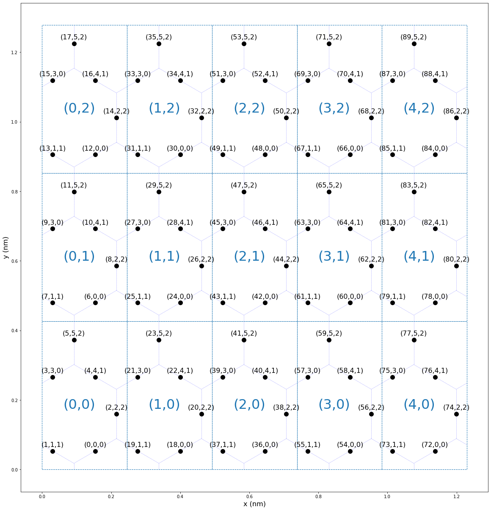

# kagomeKMC: Kagome kinetic Monte Carlo simulation



# Installation Instructions
1. In Anaconda Prompt, navigate to the repository folder: i.e. `..\kagomeKMC>`
2. Create a new conda environment with the conda dependencies:\
```conda env create --prefix ./env --file environment.yml --force```
3. Activate the new conda environment with: `conda activate kagomekmc`