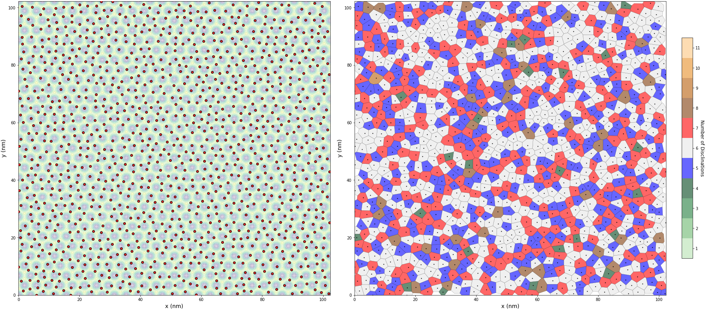
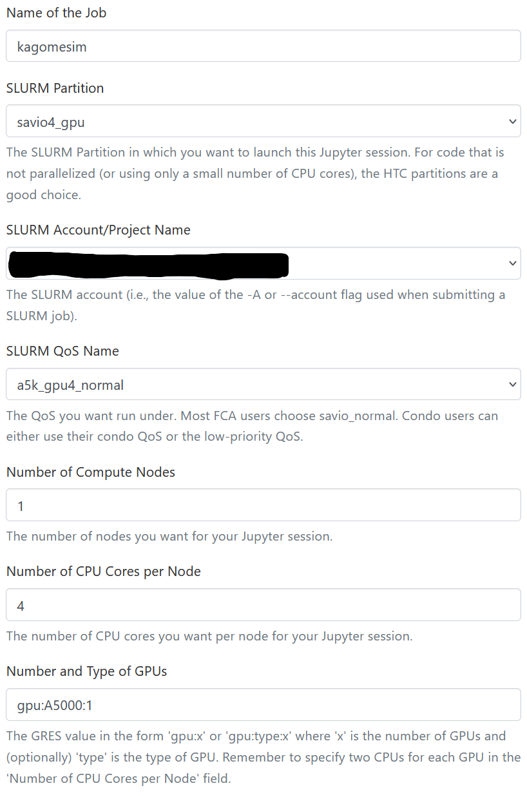

# kagomeKMC: Kagome kinetic Monte Carlo simulation

<br/>

[kagomeKMC](https://github.com/iamrameses/kagomeKMC) is a rejection-free *on-lattice* kinetic Monte Carlo simulation of the time-evolution of nanometer-sized molecules on a surface of Kagome lattice sites. Some key features of *kagomeKMC* are:
- Periodic boundary conditions.
- Transition rates takes into consideration both the lattice potential energy surface and lateral interactions between molecules.
- System temperature changes according to a defined temperature curve.
- Computations are performed on GPU via CuPy operations or Numba kernels.

For basic functionality and running a simulation, see the example notebook `kagomeKMC_v1_tutorial.ipynb`.

## Setting up environment on Berkeley Savio Servers
On the Open OnDemand Dashboard, go to "Clusters" -> ">_BRC Shell Access", then load the modules we need.

```commandline
module load cuda/12.2.1 gcc/13.2.0
```

Navigate to location where you want the repository and clone it.

```command line
cd /global/home/users/<your_username>/
git clone https://github.com/iamrameses/kagomeKMC.git
```
Since Savio gives users a limited amount of space in our home directories, its best to install all conda environments and packages in our scratch folder. It is important that `cupy` be installed last so that it is version `12.3.0` (for some reason, more recent versions result in a very slow simulation).

```commandline
KMCENV=/global/scratch/users/<your_username>/environments/kagomekmc
rm -rf $KMCENV
export CONDA_PKGS_DIRS=/global/scratch/users/<your_username>/tmp/.conda
conda create --prefix $KMCENV python=3.11
source activate $KMCENV
conda install -c conda-forge cudatoolkit
conda install -c conda-forge numba
conda install -c conda-forge freud
conda install -c conda-forge pandas matplotlib ipympl
conda install -c conda-forge cupy=12.3.0
conda install -c anaconda ipykernel
python -m ipykernel install --user --name=kagomekmc
```
Trying to install `cudatoolkit`, `numba`, and `freud` in one line  sometimes caused issues for me, so I recommend installing them separately. It's also recommended to modify your `.bashsrc` file in your root folder by adding the following lines at the very end of the script, otherwise you'll have to keep typing the above commands just to activate your environment each time you open a new shell.

```commandline
export KMCENV=/global/scratch/users/<your_username>/environments/kagomekmc
export CONDA_PKGS_DIRS=/global/scratch/users/<your_username>/tmp/.conda
```

## Requesting a Jupyter Server interactive session with GPU 
Go to "Interactive Apps" and select "Jupyter Server - compute via Slurm using Savio partitions". Name the job whatever you like, but I would recommend the below settings as a V100 GPU is ideal for this simulation.



## Running a simulation from a Jupyter Server interaction session notebook
Once you are given access to a Jupyter server and launch it, you can either run the simulation from a Jupyter notebook or from a terminal window. If you use a Jupyter notebook, just make sure you change the kernel of the notebook to the one you created in the steps above (i.e. `kagomekmc`). From there you can follow similar steps as those shown in the tutorial notebook `examples/240609_kagomeKMC_v1_tutorial.ipynb`.

## Running a simulation from a Jupyter Server interaction session terminal
You can also run the simulation from the Jupyter Server terminal window, by first modifying the `main.py` file (if needed) with your desired parameters and save it. The in the terminal window, navigate to the main folder of the repository (i.e. `~/kagomeKMC`). We can then load the required modules (if not already done), activate the appropriate conda environment, and run the simulation.

```commandline
module load cuda/12.2.1 gcc/13.2.0
conda activate kagomekmc
cd kagomeKMC
python -m src.main
```

##  Running a simulation via a SLURM job script file
You can also run a simulation by scheduling it to run via a SLURM job script (no need to launch an interactive session). This method benefits from only using the amount of compute needed for running the simulation, as it requests for a compute node, runs the simulation when a compute node is made available, and automatically terminates the compute node when the simulation is complete. 

The following modifications should be made to the example job script file below:
- Modify the `main.py` file as needed (see above).
- Create a `.sh` job script file (i.e. `kagomekmc.sh`). This needs to only be done once, afterwhich you can just edit the file as needed.
- For `--job-name=`, this can be any name but can only contain letters or dashes.
- For `--account=`, change `account_name` to the name of the project.
- Change `source activate kagomekmc` to whatever you named your environment in the previous steps.
- Change `cd kagomekmc` to the path of the main repository directory.

```commandline
#!/bin/bash
# Job name:
#SBATCH --job-name=kagomekmc
#
# Account:
#SBATCH --account=account_name
#
# Partition:
#SBATCH --partition=savio3_gpu
#
# Number of nodes:
#SBATCH --nodes=1
#
# Number of tasks (one for each GPU desired for use case) (example):
#SBATCH --ntasks=1
#
# Processors per task:
#SBATCH --cpus-per-task=4
#
# Number of GPUs:
#SBATCH --gres=gpu:V100:1
#
# Wall clock limit:
#SBATCH --time=72:00:00
#
## Commands to run:
module load cuda/12.2.1  gcc/13.2.0
source activate $KMCENV
cd kagomeKMC
python -m src.main
```

Then in "Clusters" -> ">_BRC Shell Access", enter the following `sbatch` command to run the simulation in the background:

```commandline
sbatch kagomekmc.sh
```